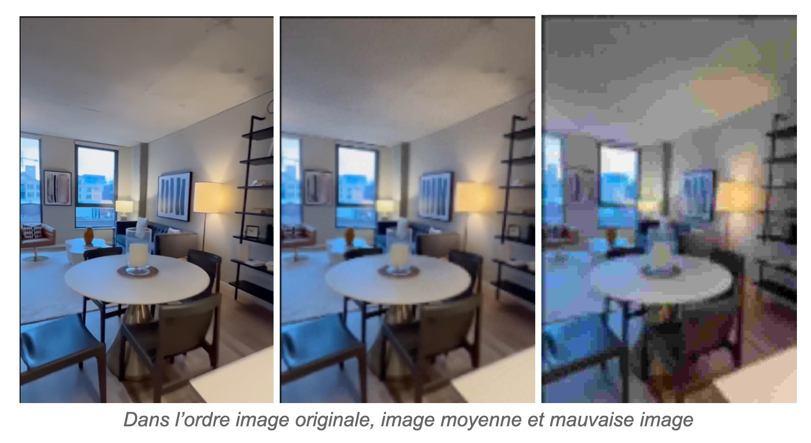
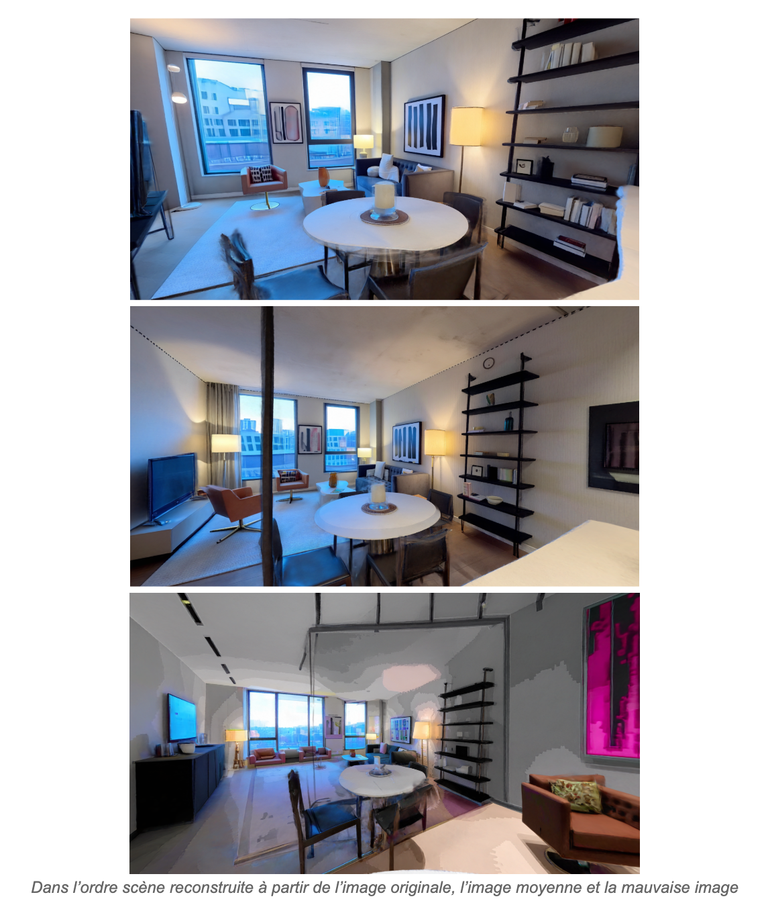
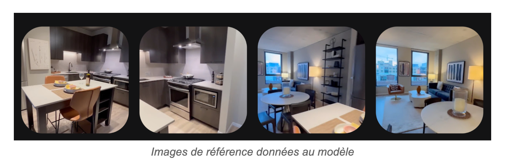
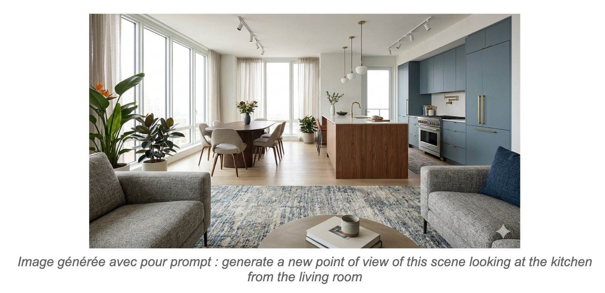
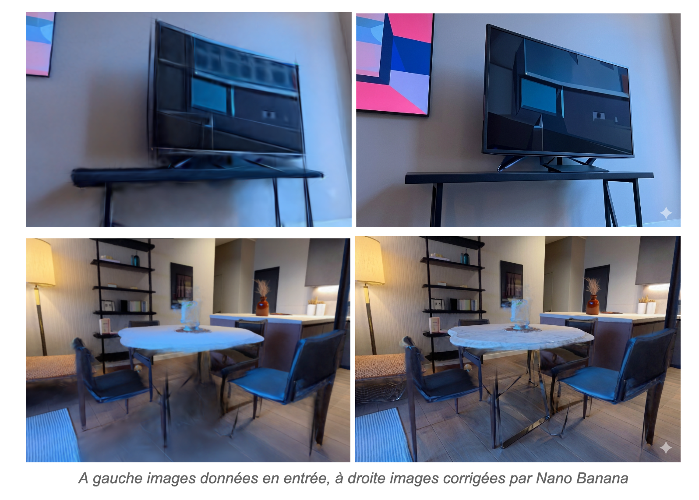
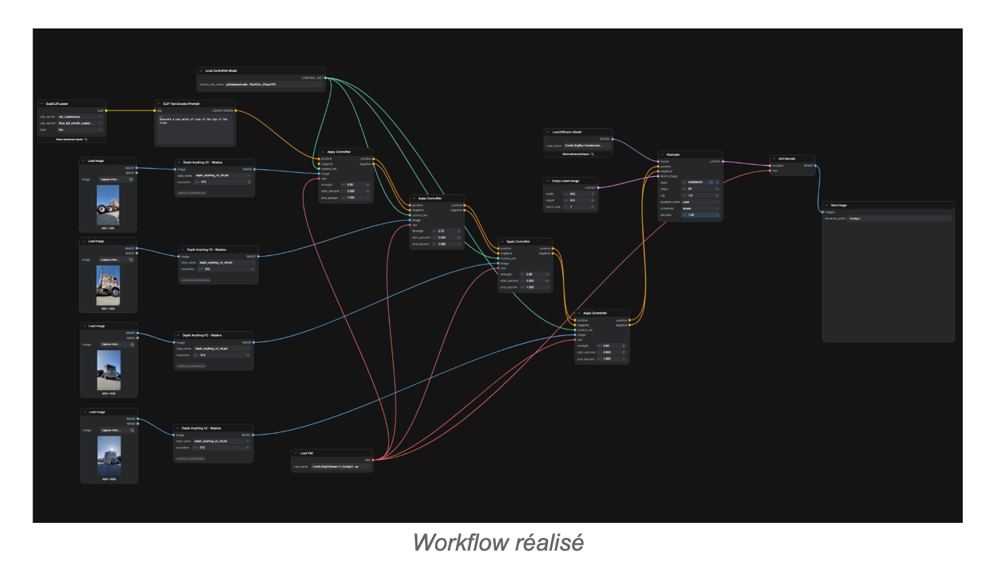
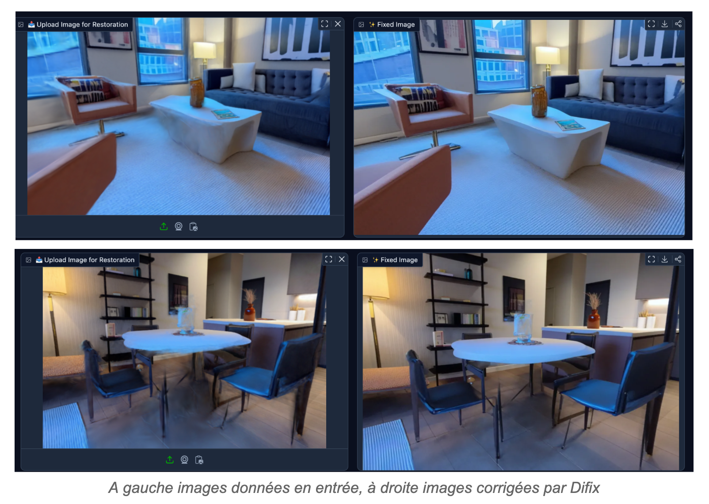
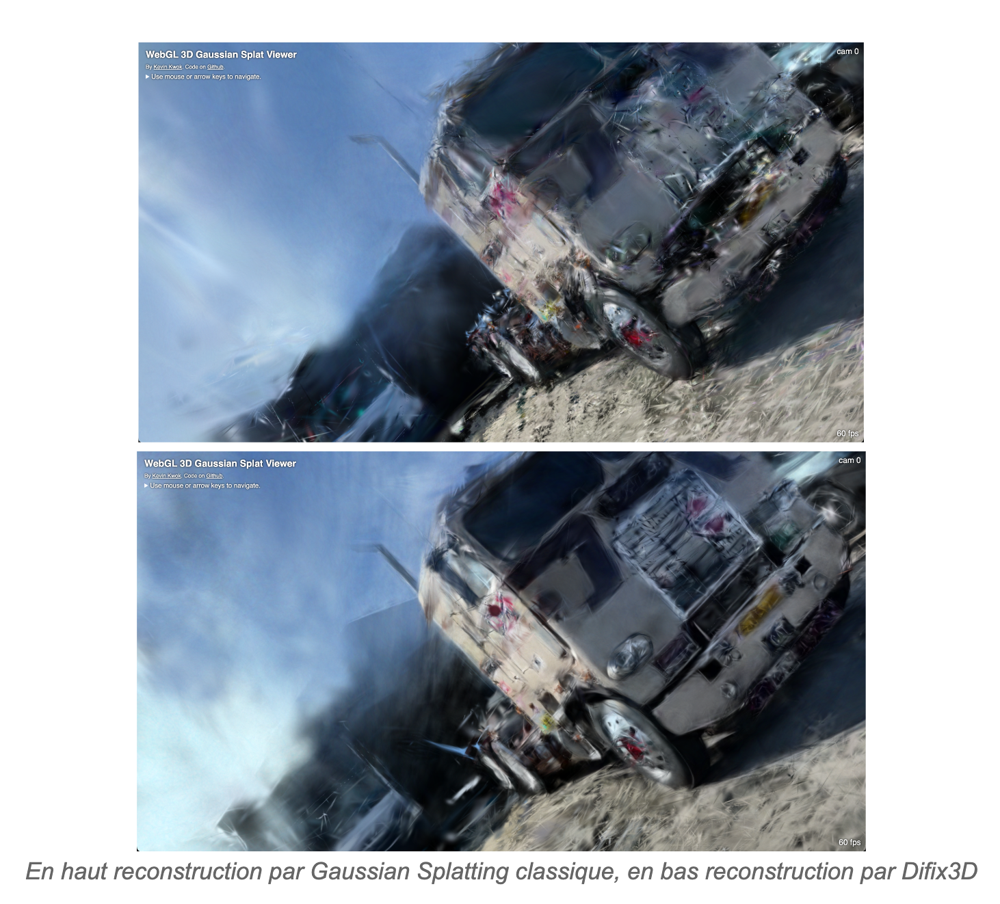

# Gaussian Splatting

Ce dépôt sert de trace écrite du projet que j'ai réalisé sous la direction de Damien Marchal sur le Gaussian Splatting de mai à juin 2026. Vous y trouverez un rapport ci-dessous ainsi qu'un fichier markdown expliquant comment utiliser Difix3D (sur une instance RunPod dans mon cas).

## Présentation du projet

Pour l’étude et la simulation de robots déformables, des scènes en 3D réalistes sont
nécessaires. Pour le moment, ces scènes sont faites manuellement par des humains, ce qui
est coûteux en temps. Cependant, il existe de nouvelles méthodes qui permettent, à partir
d’une vidéo d’une pièce, de la reconstruire digitalement. L’objectif de mon projet était donc
de prendre connaissance de ces méthodes, de les utiliser et potentiellement de les
améliorer. Plus précisément, on s'intéresse à la reconstruction par Gaussian Splating, qui
permet de passer d’un ensemble d’images à une scène 3D composées de gaussiennes 3D.

## Recherche sur l’état de l’art

Au commencement du projet, le but était alors de m’informer sur les méthodes à l’état de
l’art. Ainsi en plus du Gaussian Splating, on peut citer NeRF, qui est une technique qui utilise
un réseau de neurones pour reconstruire une scène en 3D, cependant cette méthode est
plus lente.

Aussi une première intuition a été d’utiliser des modèles d’upscaling pour améliorer la qualité
des images avant la reconstruction, ce qui pourrait en théorie permettre d’obtenir de
meilleures reconstructions. J’ai donc effectué un travail de recherche pour avoir une idée
des modèles d’upscaling actuels. On peut ainsi citer Real-ESRGAN qui est un modèle qui
utilise une architecture GAN et SeedVR2 qui lui utilise un modèle de diffusion, comme étant
les modèles les plus performants.

## Expérimentation sur la reconstruction par Gaussian Splating

La première expérimentation avait pour objectif de déterminer si la qualité des images
utilisées lors de la reconstruction avait un impact sur celle-ci. Pour cela j’ai pris un ensemble
d’images d’un appartement, que j’ai décliné trois fois, la copie originale, une copie de qualité
moyenne et une copie de mauvaise qualité.

J’ai ensuite utilisé le site Marble pour reconstruire des scènes 3D à partir des différents ensembles. On constate ainsi que les
images de meilleure qualité donnent les reconstructions de meilleure qualité.

## Génération de nouveaux points de vue avec un modèle de diffusion
J’ai voulu ensuite tester la capacité des modèles de diffusion à générer de nouveaux points
de vue d’une scène. J’ai donc demandé à Nano Banana, le modèle de diffusion de Google,
de générer un nouveau point de vue d’une scène dont je lui avais fourni une image.

Cependant les résultats n’étaient pas satisfaisants, non seulement le modèle avait changé
les couleurs de la scène, certains objets peuvent être modifiés, disparaître ou encore
bouger. Il est donc compliqué pour ce modèle de générer un nouveau point de vue qui soit
cohérent avec le point de vue de référence donné.

## Correction d’artéfacts de reconstruction grâce à un modèle de diffusion

Une autre intuition a été de capturer des points de vue de la scène reconstruite, de corriger
sur l’image les artéfacts apparues lors de la reconstruction grâce à un modèle de diffusion et
d’ensuite reconstruire la scène avec la nouvelle image. J’ai donc donné à Nano Banana des
captures d’une scène reconstruite avec pour prompt de corriger les artéfacts et flous
présents dans l’image. Cette fois-ci le modèle a bien réussi à retirer les imperfections des
images, cependant on peut difficilement se reposer dessus car les corrections ne sont pas
forcément cohérentes entre différentes images.

## Modèles de diffusion et Gaussian Splating

J’ai ensuite cherché à savoir s'il y avait déjà eu des travaux liant Gaussian Splatting et les
modèles de diffusion. J’ai ainsi trouvé des algorithmes qui utilisent des modèles de diffusion
2D afin d’améliorer la qualité de scènes 3D reconstruites par Gaussian Splatting, notamment
GaussianSR et S2Gaussian. Pour ce qui est de la génération 3D, l’état de l’art en est
seulement à la génération d’objets en 3DGS grâce à des modèles de diffusion, la génération
de scène entière n’étant pas encore faisable en particulier à cause du manque de données.
L’édition de scène 3DGS est-elle possible grâce à des modèles comme GaussCTRL,
EditSplat et 3DSceneEdit.

## Workflows ComfyUI

La piste suivante était celle des workflows ComfyUI, cet outil permet de manipuler les
différentes composantes d’un modèle génératif grâce à une interface intuitive sous forme de
graphe. L’objectif était de générer un nouveau point de vue d’une scène, en donnant en
entrée des images de celle-ci. J’ai donc conçu un workflow qui prend des images d’une
scène en entrée, en extrait des images de profondeur que l’on donne à un controlnet qui va
à son tour donner un prompt à un modèle de diffusion (Flux Kontext). Cependant je n’ai pas
pu tester si cette approche était viable.

## Difix3D

Le reste du projet, je me suis intéressé à Difix3D, un algorithme publié par NVIDIA qui
permet d’améliorer la qualité d’une scène 3DGS grâce à un modèle de diffusion 2D entraîné
pour cette tâche. En effet, à la base de cette méthode on retrouve un modèle de diffusion, le
Stable Diffusion Turbo, qui a la capacité de générer une image rapidement avec une seule
étape de diffusion. Les chercheurs ont donc réutilisé les poids de ce modèle pour le fine
tuner avec des images contenant des artéfacts de reconstruction, en lui donnant comme
prompt de retirer ces artéfacts. Par la suite ce modèle est utilisé pour corriger les points de
vue capturés d’une reconstruction 3DGS, pour ensuite relancer un cycle de reconstruction
avec Gaussian Splating mais cette fois avec les images corrigées.

En cherchant un peu, j’ai pu trouver une démo de Difix disponible sur Huggingface. J’ai donc
mis à l’épreuve les capacités de correction du modèle sur des captures de scènes 3DGS
que j’avais reconstruites avec Marble. J’ai ainsi constaté que Difix arrivait bien à ajouter de
la netteté dans les images traitées et à retirer les artéfacts. Cependant, si les modifications à
faire sont trop importantes, le modèle ne parvient pas à les corriger, par exemple un pied
manquant sur une chaise.

J’ai ensuite expérimenté avec Difix3D, pour faire cela j’ai dû créer une instance GPU sur
Runpod afin d’avoir assez de VRAM pour pouvoir utiliser le modèle. J’ai d’abord utilisé
l’algorithme sur une vidéo de deux minutes d’un robot avec l’implémentation originale
publiée par les auteurs de l’article. Cependant, la reconstruction a pris plusieurs heures et le
résultat était de moindre qualité comparé à une reconstruction 3DGS simple que j’avais faite
au préalable. J’ai par la suite trouvé un fork de l’algorithme qui se concentre particulièrement
sur la reconstruction 3DGS et corrige certains bugs. J’ai ainsi relancé des expérimentations,
cette fois-ci avec une courte vidéo d’un camion. J’ai alors constaté que cette fois Difix3D
fournissait une meilleure reconstruction comparée à une reconstruction par Gaussian
Splatting classique. A la suite de ça, j’ai aussi écrit un readme détaillé avec toutes les
commandes nécessaires afin d’utiliser Difix3D, avec des images de mes expérimentations.

