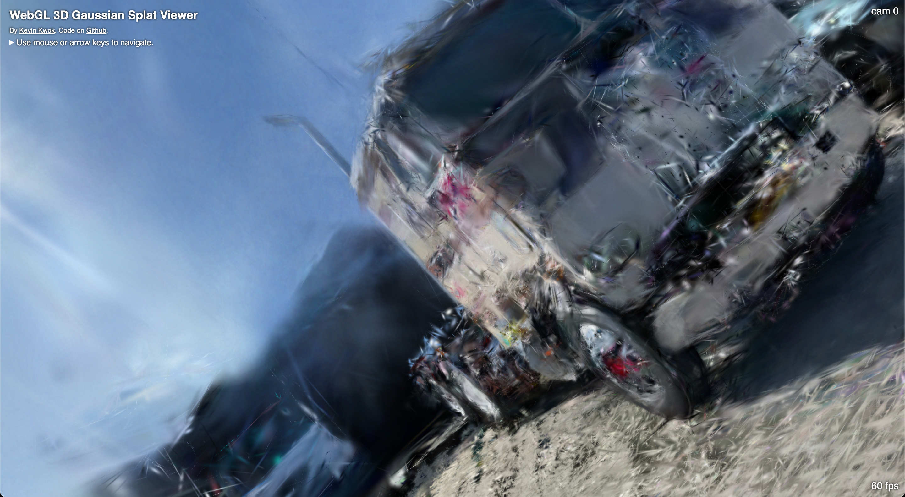
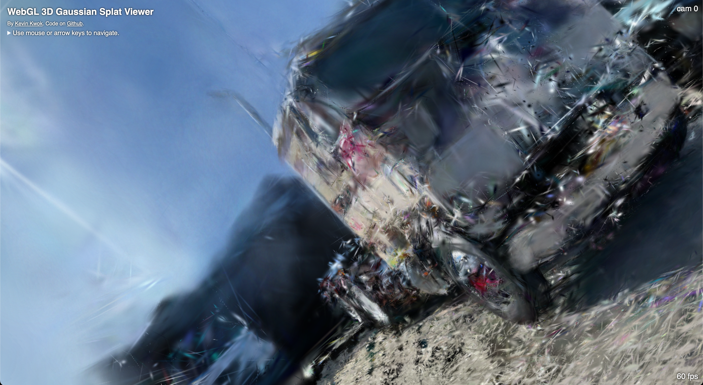
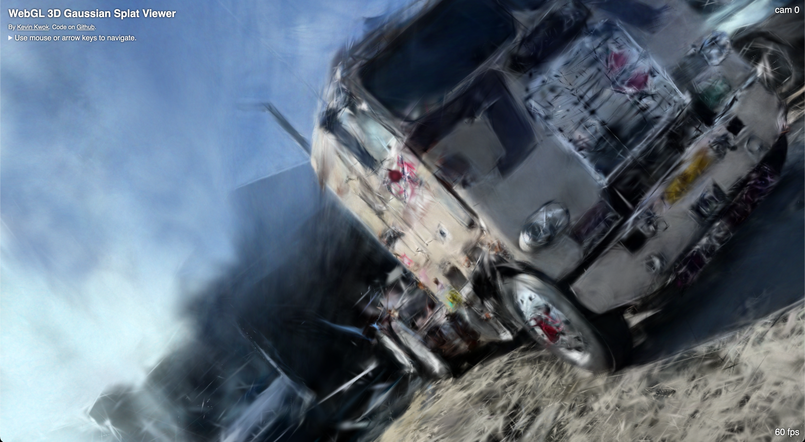
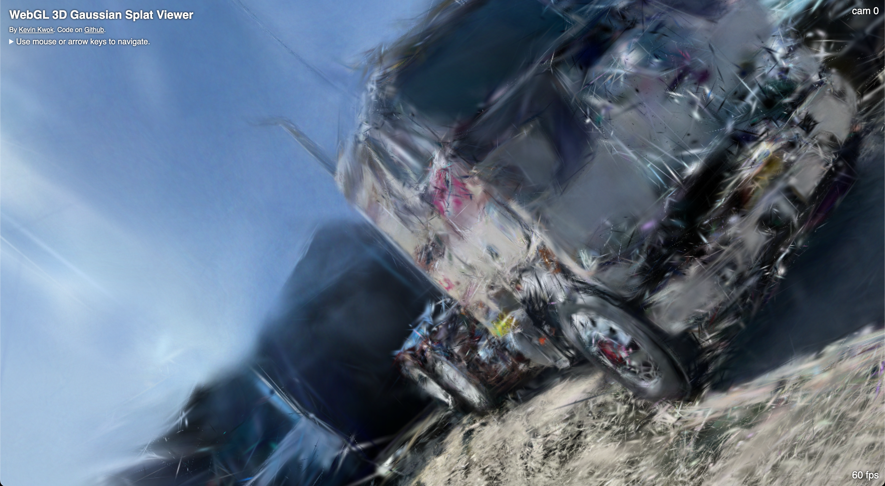

# Difix3D

## Setup l'environnement anaconda

Installer Anaconda si ce n'est pas déjà fait:
```
wget https://repo.anaconda.com/miniconda/Miniconda3-latest-Linux-x86_64.sh
bash Miniconda3-latest-Linux-x86_64.sh
source ~/.bashrc
```

On doit ensuite créer un environnement pour Gsplat et un autre pour Difix3D :

```
conda create -n gsplat python=3.10

conda create -n difix3d python=3.10
```

## Extraire les images avec ffmpeg

Avant de pouvoir utiliser Colmap, on doit extraire des images de la vidéo. Pour faire cela, on active l'environnement `gsplat` et on installe ffmpeg :
```
conda activate gsplat
conda install -c conda-forge ffmpeg
```

Cette commande indique que l'on garde 2 images pour chaque seconde de la vidéo, si on veut une meilleure reconstruction on peut augmenter cette valeur cependant les reconstructions seront plus lentes.
```
mkdir -p images
ffmpeg -i truck.mp4 -qscale:v 1 -qmin 1 -vf fps=2 images/%04d.jpg
```

```
mkdir colmap
mv /root/images /root/colmap/images
```

On peut ensuite créer les dossiers pour les différentes résolutions de nos images. Par exemple, dans le dossier `images_2` les images sont deux fois plus petites en hauteur et en largeur, on sélectionnera ce dossier avec le drapeau `--data_factor 2` lors de la reconstruction. Là aussi, choisir des images de grandes résolutions ralentit considérablement la reconstruction.
```
mkdir -p /root/colmap/images_2 /root/colmap/images_4 /root/colmap/images_8

ffmpeg -i '/root/colmap/images/%04d.jpg' -vf scale=iw/2:ih/2 -qscale:v 1 '/root/colmap/images_2/%04d.jpg'
ffmpeg -i '/root/colmap/images/%04d.jpg' -vf scale=iw/4:ih/4 -qscale:v 1 '/root/colmap/images_4/%04d.jpg'
ffmpeg -i '/root/colmap/images/%04d.jpg' -vf scale=iw/8:ih/8 -qscale:v 1 '/root/colmap/images_8/%04d.jpg'
```

## Traitement des images avec colmap

Maintenant qu'on a les images, on peut appliquer Colmap dessus, on installe donc Colmap :
```
conda install -c conda-forge colmap
```

On traite les images avec Colmap :
```
colmap feature_extractor \
    --database_path /root/colmap/database.db \
    --image_path /root/colmap/images/ \
    --ImageReader.camera_model PINHOLE \
    --ImageReader.single_camera 1

colmap exhaustive_matcher \
    --database_path /root/colmap/database.db

mkdir -p colmap/sparse

colmap mapper \
    --database_path /root/colmap/database.db \
    --image_path /root/colmap/images/ \
    --output_path /root/colmap/sparse/
```

## Reconstruction avec gsplat

On peut à présent installer les modules nécessaires pour Gsplat :
```
pip install torch==2.4.0 torchvision==0.19.0 --index-url https://download.pytorch.org/whl/cu124
```

On installe ensuite l'implémentation de Gsplat de Nerfstudio car c'est celle utilisée dans l'article :
```
pip install ninja numpy jaxtyping rich
pip install https://github.com/nerfstudio-project/gsplat/releases/download/v1.4.0/gsplat-1.4.0%2Bpt24cu124-cp310-cp310-linux_x86_64.whl
```

On clone le dépôt pour avoir accès au script de reconstruction:
```
git clone https://github.com/nerfstudio-project/gsplat.git

cd gsplat

git checkout v1.4.0
```

```
pip install --no-build-isolation -r examples/requirements.txt
```

On peut alors lancer la reconstruction avec Gsplat, que l'on utilisera comme baseline. On remarque que le drapeau `--data_factor` est mis à `4` car on utilisera cette même valeur lors des reconstructions avec Difix3D, on effectue 60000 itérations pour la même raison. Cette commande créera les checkpoints à 30000 itérations et à 60000 itérations.
```
python examples/simple_trainer.py default \
    --data_dir /root/colmap/ \
    --data_factor 4 \
    --result_dir /root/results/my_scene \
    --max_steps 60000
```

## Reconstruction avec Difix3D

On passe alors à la reconstruction avec Difix3D, on active l'environnement créé préalablement et on clone le dépot :
```
conda activate difix3d

git clone https://github.com/ligaoqi2/Difix3d-3dgs-demo/

cd Difix3d-3dgs-demo
```

### Difix3d-3dgs-demo
Au lieu d'utiliser le code original, j'utilise un fork qui a été conçu spécifiquement pour la reconstruction 3DGS car j'ai trouvé qu'il fonctionnait mieux et avec moins de problèmes. La principale source des problèmes avec l'implémentation de NVDIA est une contrainte sur le dossier `colmap` qui demande de faire un split train/eval des images, cependant les chercheurs ne précisent pas en détail comment faire cette séparation (https://github.com/nv-tlabs/Difix3D/issues/10). Dans le fork, l'auteur contourne cette contrainte (https://github.com/ligaoqi2/Difix3d-3dgs-demo/commit/761bcb45f0e3573c9db3c6bd685d9d08ce38fbb2#diff-e14064bd217f49afc71208ce3d135cb1d4320287462bda01d7bb0f3efcb086d9).
## 

On installe ensuite les modules nécessaires ainsi que Gsplat car Difix3D l'utilise lors de la reconstruction:
```
pip install --no-cache-dir torch==2.6.0 torchvision==0.21.0 torchaudio==2.6.0 --index-url https://download.pytorch.org/whl/cu124

pip install git+https://github.com/nerfstudio-project/gsplat.git --no-build-isolation  # peut prendre une dizaine de minutes
```

Avant de lancer les reconstructions, on doit changer le nombre d'itérations que l'on souhaite effectuer dans le script (l'auteur précise qu'il bride volontairement le modèle à 10000 itérations car son GPU n'a pas assez de VRAM) :
```
sed -i '91s/max_steps: int = [0-9_]*.*/max_steps: int = 60_000         # 本地最大支持 60_000 steps/' examples/gsplat/simple_trainer_difix3d.py
```

### Reconstruction avec 60000 itérations sans checkpoint

Cette commande permet de lancer une reconstruction avec Difix3D en partant de 0, des checkpoints seront créé à 30000 itérations et à 60000 itérations :
```
PYTHONPATH=/root/Difix3d-3dgs-demo CUDA_VISIBLE_DEVICES=0 python examples/gsplat/simple_trainer_difix3d.py default     --data_dir /root/colmap     --data_factor 4     --result_dir /root/results/difix_scene    --test_every 1 
```

### Reconstruction avec 60000 itérations avec checkpoint

Cette commande permet de lancer une reconstruction avec Difix3D en partant d'un checkpoint à 30000 itérations réalisé par Gsplat (il y aura au final 30000 itérations par Gsplat + 30000 itérations par Difix3D, donc 60000 itérations au total), des checkpoints seront créés à 30000 itérations et à 60000 itérations :
```
PYTHONPATH=/root/Difix3d-3dgs-demo CUDA_VISIBLE_DEVICES=0 python examples/gsplat/simple_trainer_difix3d.py default     --data_dir /root/colmap     --data_factor 4     --result_dir /root/results/difix_scene    --test_every 1     --ckpt /root/results/my_scene/ckpts/ckpt_29999_rank0.pt
```

Aussi le drapeau `--no-normalize-world-space` est présent dans la commande indiquée dans le readme de Difix3D (https://github.com/nv-tlabs/Difix3D/blob/c76edc595586e16732c91ddee82f3a6d83a8a9cc/README.md?plain=1#L199), je ne l'utilise pas car j'obtiens de meilleurs résultats lorsque je le retire.

## Conversion d'un fichier .pt vers un fichier .ply

Afin de pouvoir visualiser les checkpoints, il faut les convertir en fichier .ply. Pour faire cela j'utilise un script écrit par un utilisateur (https://github.com/nv-tlabs/Difix3D/pull/23/commits/4c4544c75a25fa66cf0859f269101917cfe3e368), que j'ai importé dans Google Colab (https://colab.research.google.com/drive/1Bh8SNmupzJYjVsiEijWKbC5JvyrEvHkK?usp=sharing).

## Expériences

Gsplat :

| 30000 itérations | 60000 itérations |
|-------|-------|
|  |  |

Difix3D sans checkpoint :

| 30000 itérations | 60000 itérations |
|-------|-------|
|  |  |

Difix3D avec checkpoint :

| 60000 itérations |
|-------|
|  |